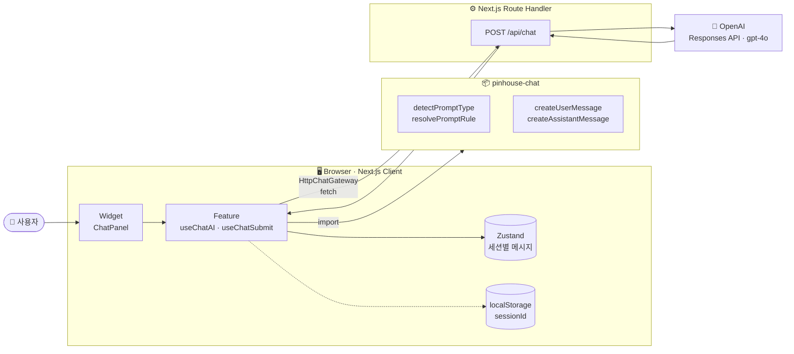
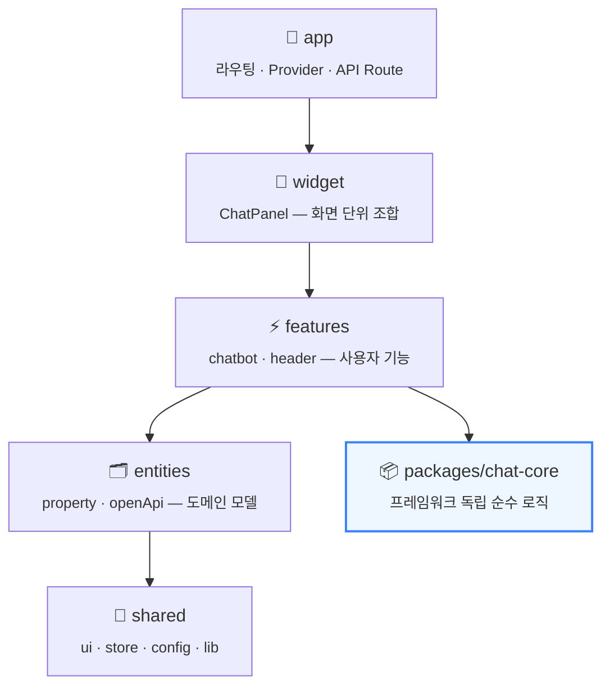
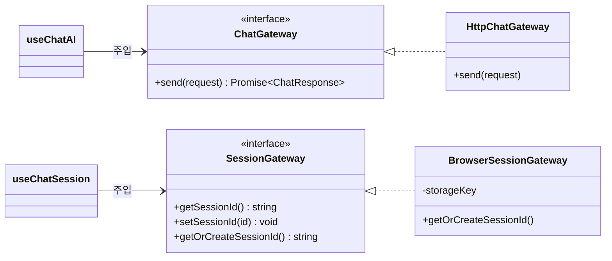
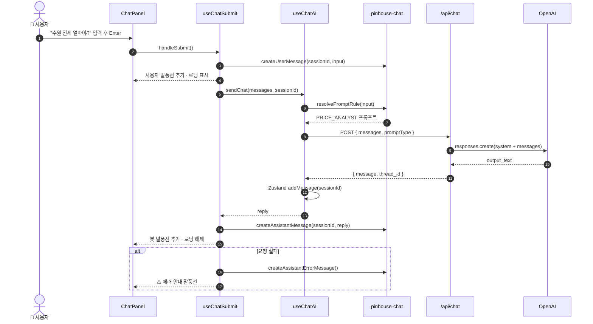
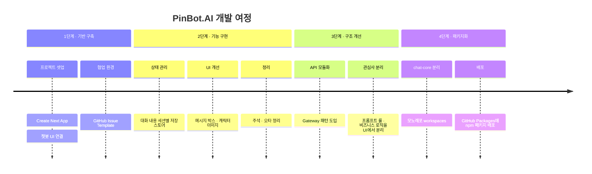

<div align="center">


# 🏠 핑구네 부동산 · PinBot.AI

**시세 · 대출 · 추천을 한 번에 물어보는 AI 부동산 챗봇**

"매탄힐스테이트 시세 알려줘" 한 줄이면 질문 의도에 맞는 전문가 AI가 대신 답해줍니다.

<br />


<br />


</div>

<br />

## 📑 목차

1. [만들게 된 계기](#-만들게-된-계기)
2. [주요 기능](#-주요-기능)
3. [아키텍처](#-아키텍처)
4. [동작 프로세스](#-동작-프로세스)
5. [개발 과정](#-개발-과정)
6. [프로젝트 구조](#-프로젝트-구조)
7. [chat-core 패키지](#-chat-core-패키지)
8. [시작하기](#-시작하기)
9. [알려진 이슈 & 개선 과제](#-알려진-이슈--개선-과제)
10. [로드맵](#-로드맵)

<br />

## 💡 만들게 된 계기

> **"집 알아볼 때마다 탭이 10개씩 열린다."**

부동산 정보를 찾으려면 실거래가 사이트, 은행 대출 계산기, 커뮤니티 후기, 학군 정보를 **따로따로** 뒤져야 합니다.
막상 찾아도 LTV·DSR 같은 용어는 어렵고, "그래서 이 동네 전세가 대충 얼마인데?"라는 **간단한 질문에 바로 답해주는 곳**은 없었습니다.

| 😣 기존의 불편함 | ✨ PinBot.AI의 접근 |
| :--- | :--- |
| 시세·대출·학군 정보가 여러 사이트에 흩어져 있음 | **대화창 하나**에서 질문 |
| 정보가 부족하면 "알 수 없음"으로 끝남 | 조건이 부족해도 **추정 범위를 먼저 제시**하고 추가 질문 |
| 금융·부동산 용어가 어려움 | 질문 유형별 **전문가 페르소나**가 쉬운 말로 설명 |
| 챗봇 로직이 UI에 묶여 재사용이 어려움 | 핵심 로직을 **npm 패키지로 분리**해 어디서든 재사용 |

<br />

## 🚀 주요 기능

<table>
  <tr>
    <td width="50%" valign="top">
      <h3>🧠 질문 의도 기반 프롬프트 라우팅</h3>
      사용자 입력의 키워드를 분석해 알맞은 <b>전문가 역할(System Prompt)</b>을 자동으로 선택합니다.
      <br /><br />
      <code>시세</code> <code>가격</code> → 시세 분석가<br />
      <code>추천</code> → 부동산 컨설턴트<br />
      <code>대출</code> <code>LTV</code> → 대출 상담 전문가<br />
      그 외 → 기본 부동산 챗봇
    </td>
    <td width="50%" valign="top">
      <h3>📊 추정 범위 우선 응답</h3>
      "얼마야?"라는 질문에 단일 숫자 대신 <b>"약 X~Y" 범위</b>로 답합니다.
      <br /><br />
      • 면적 미상 → 59㎡ / 84㎡ 두 가지 시나리오<br />
      • 연식 미상 → 준신축 / 구축 비교<br />
      • 월세 → 보증금·월세 조합 2~3개<br />
      • 정확도를 높이기 위한 추가 질문 제안
    </td>
  </tr>
  <tr>
    <td width="50%" valign="top">
      <h3>💬 세션 기반 대화 관리</h3>
      브라우저별 <code>sessionId</code>(UUID)를 발급해 localStorage에 유지하고,
      <b>Zustand 스토어</b>에 세션 단위로 대화 내역을 저장합니다.
    </td>
    <td width="50%" valign="top">
      <h3>📦 재사용 가능한 Chat Core</h3>
      프롬프트 규칙 · 메시지 생성 · 타입을 <code>@kyungchan3007/pinhouse-chat</code>
      패키지로 분리해 <b>GitHub Packages</b>에 배포했습니다. 다른 서비스에서도 설치만 하면 같은 챗봇 로직을 쓸 수 있습니다.
    </td>
  </tr>
  <tr>
    <td width="50%" valign="top">
      <h3>🔌 Gateway 패턴으로 통신 추상화</h3>
      <code>ChatGateway</code> / <code>SessionGateway</code> 인터페이스로 통신·저장소를 추상화했습니다.
      HTTP 대신 WebSocket, localStorage 대신 서버 세션으로 <b>구현체만 갈아끼우면</b> 됩니다.
    </td>
    <td width="50%" valign="top">
      <h3>🎨 메신저 스타일 UI</h3>
      말풍선 UI, 입력 중 로딩 애니메이션, 자동 스크롤,
      <kbd>Enter</kbd> 전송 / <kbd>Shift</kbd>+<kbd>Enter</kbd> 줄바꿈을 지원합니다.
    </td>
  </tr>
</table>

<br />

## 🏗 아키텍처

### 전체 시스템 구조



### 레이어 구조 (Feature-Sliced Design)

상위 레이어는 하위 레이어만 참조하도록 **단방향 의존성**을 유지합니다.



### Gateway 패턴

UI와 hook은 **인터페이스에만 의존**하고, 실제 구현체는 주입받습니다.



<br />

## 🔄 동작 프로세스

### 메시지 전송 흐름



### 프롬프트 라우팅 규칙

```mermaid
flowchart TD
    In(["📝 사용자 입력"]) --> Q1{"'시세' 또는<br/>'가격' 포함?"}
    Q1 -- Yes --> PA["📈 PRICE_ANALYST<br/>시세 요약 · 6개월 추이"]
    Q1 -- No --> Q2{"'추천' 포함?"}
    Q2 -- Yes --> CS["🧭 CONSULTANT<br/>예산·목적별 단계적 추천"]
    Q2 -- No --> Q3{"'대출' 또는<br/>'LTV' 포함?"}
    Q3 -- Yes --> PO["🏦 POLICY<br/>대출 한도 · LTV/DSR 안내"]
    Q3 -- No --> BA["🏠 BASE<br/>추정 범위 우선 응답"]

    PA & CS & PO & BA --> GPT(["🤖 System Prompt로 GPT 호출"])
```



<br />

## 🛤 개발 과정



| 단계 | 고민 | 해결 |
| :---: | :--- | :--- |
| **1** | 빠르게 동작하는 챗봇을 만들고 싶다 | Next.js App Router + Route Handler로 서버·클라이언트를 한 프로젝트에서 구성 |
| **2** | 새로고침·세션마다 대화가 섞인다 | `sessionId`를 발급하고 Zustand에 **세션 단위**로 메시지 저장 |
| **3** | 컴포넌트 안에 `fetch`와 프롬프트 로직이 뒤섞였다 | `ChatGateway` 인터페이스 + 커스텀 hook으로 **UI와 로직 분리** |
| **4** | 다른 서비스에서도 같은 챗봇 로직을 쓰고 싶다 | 순수 로직을 `packages/chat-core`로 추출해 **npm 패키지로 배포** |

<br />

## 📂 프로젝트 구조

```bash
property/
├── app/                              # Next.js App Router
│   ├── api/chat/route.ts             # 🔐 OpenAI 호출 Route Handler
│   ├── layout.tsx                    # Provider 주입
│   └── page.tsx                      # 메인 페이지 → ChatPanel
│
├── src/
│   ├── app/providers.tsx             # React Query Provider
│   ├── widget/ui/chatPanel/          # 🧩 챗봇 화면 조합
│   ├── features/
│   │   ├── chatbot/
│   │   │   ├── model/
│   │   │   │   ├── chatGateway.ts            # 통신 인터페이스
│   │   │   │   ├── httpChatGateway.ts        # HTTP 구현체
│   │   │   │   ├── sessionGateway.ts         # 세션 인터페이스
│   │   │   │   ├── browserSessionGateway.ts  # localStorage 구현체
│   │   │   │   ├── useChatAI.ts              # GPT 요청 hook
│   │   │   │   ├── useChatSubmit.ts          # 입력·전송 hook
│   │   │   │   ├── useChatSession.ts         # 세션 초기화 hook
│   │   │   │   └── promptStore.ts            # Zustand 스토어
│   │   │   ├── types/                        # 메시지·스토어 타입
│   │   │   └── ui/                           # ChatHistory, SumitButton
│   │   └── header/                           # 상단 헤더
│   ├── entities/                     # 도메인 모델 (property, openApi)
│   └── shared/                       # 공용 UI · 스토어 · 설정
│
├── packages/
│   └── chat-core/                    # 📦 @kyungchan3007/pinhouse-chat
│       └── src/
│           ├── prompt.ts             # PROMPT_RULES · detectPromptType
│           ├── messages.ts           # 메시지 팩토리 함수
│           └── chatTypes.ts          # 공용 타입
│
└── propertyInfo/                     # 📊 한국부동산원 통계표 코드 (향후 연동용)
```

<br />

## 📦 chat-core 패키지

프레임워크에 의존하지 않는 챗봇 핵심 로직을 별도 패키지로 제공합니다.

```bash
# .npmrc
@kyungchan3007:registry=https://npm.pkg.github.com

npm install @kyungchan3007/pinhouse-chat
```

```ts
import {
  resolvePromptRule,
  createUserMessage,
  toChatRequestMessages,
} from "@kyungchan3007/pinhouse-chat";

const systemPrompt = resolvePromptRule("강남 아파트 대출 한도 알려줘"); // → POLICY 규칙
const message = createUserMessage(sessionId, "강남 아파트 대출 한도 알려줘");
```

| Export | 설명 |
| :--- | :--- |
| `PROMPT_RULES` | BASE · PRICE_ANALYST · CONSULTANT · POLICY 시스템 프롬프트 |
| `detectPromptType(input)` | 입력 문자열 → 프롬프트 키 |
| `resolvePromptRule(input)` | 입력 문자열 → 프롬프트 본문 |
| `createUserMessage` / `createAssistantMessage` / `createAssistantErrorMessage` | 메시지 객체 생성 |
| `toChatRequestMessages` | 히스토리 메시지 → API 요청 형태 변환 |
| `ChatRole` · `ChatRequestMessage` · `ChatHistoryMessage` | 공용 타입 |

<br />

## 🏁 시작하기

### 1. 환경 변수 설정

```bash
# .env
OPENAI_API_KEY=sk-...
NPM_TOKEN=ghp_...   # GitHub Packages 접근용 (read:packages)
```

### 2. 설치 및 실행

```bash
npm install
npm run dev        # http://localhost:3000
```

### 3. 빌드 · 배포

```bash
npm run build
vercel --prod
```

### 4. chat-core 패키지 배포

```bash
cd packages/chat-core
npm publish        # prepublishOnly에서 자동 빌드
```

<br />

## 🩺 알려진 이슈 & 개선 과제

### 👍 현재 구조의 장점

- UI · 도메인 hook · 전송 계층(gateway)의 분리가 명확함
- 세션 처리 추상화가 단순해 테스트 및 확장에 유리함
- 프롬프트 규칙이 UI에서 분리되어 재사용성이 좋음
- gateway 인터페이스 기반이라 향후 API 공급자 교체에 대응하기 쉬움

### ⚠️ 확인된 리스크

| # | 이슈 | 내용 |
| :---: | :--- | :--- |
| 1 | ESLint 설정 실행 오류 | `eslint.config.mjs`에서 ESM 환경과 맞지 않는 `require` 사용으로 `npm run lint` 실패 |
| 2 | 빌드 시 폰트 네트워크 의존성 | `app/layout.tsx`의 Google Fonts(`Geist`, `Geist Mono`) fetch 실패 시 `npm run build` 중단 |
| 3 | 네이밍 · 일관성 부채 | `SumitButton` 오타, 네이밍 규칙 혼재, 비어 있는 모듈 존재 |
| 4 | 패키지 명칭 불일치 | 메타데이터는 `@kyungchan3007/pinhouse-chat`, 앱 import는 `pinhouse-chat` (tsconfig `paths` 설정에 의존) |
| 5 | API 요청 검증 부족 | `/api/chat`에 `promptType` 등 요청 본문 스키마 검증이 없음 |

### 🔧 권장 후속 작업

1. ESLint flat config를 ESM 방식(`import`)으로 정리
2. Google Fonts 런타임 fetch 의존성을 줄이고 로컬 또는 대체 폰트 전략 적용
3. `/api/chat` 요청 스키마 검증(zod 등) 및 에러 타입 안정성 강화
4. `SubmitButton` 등 네이밍 표준화 및 미사용/빈 모듈 정리
5. `packages/chat-core`에 프롬프트 판별 및 메시지 팩토리 단위 테스트 추가

<br />

## 🗺 로드맵

- [x] OpenAI 연동 챗봇 UI
- [x] 세션별 대화 저장
- [x] Gateway 패턴으로 통신 추상화
- [x] chat-core 패키지 분리 및 배포
- [ ] 국토교통부 실거래가 API 연동
- [ ] 한국부동산원 통계(`propertyInfo/`) 기반 실데이터 응답
- [ ] 스트리밍 응답
- [ ] 지하철 · 학군 정보 연동

<br />

<div align="center">

**Made with 🐧 by [kyungchan3007](https://github.com/kyungchan3007)**

</div>
